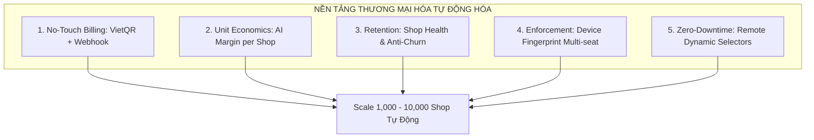
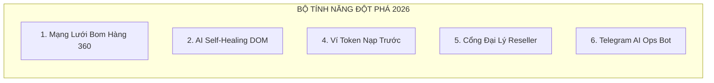
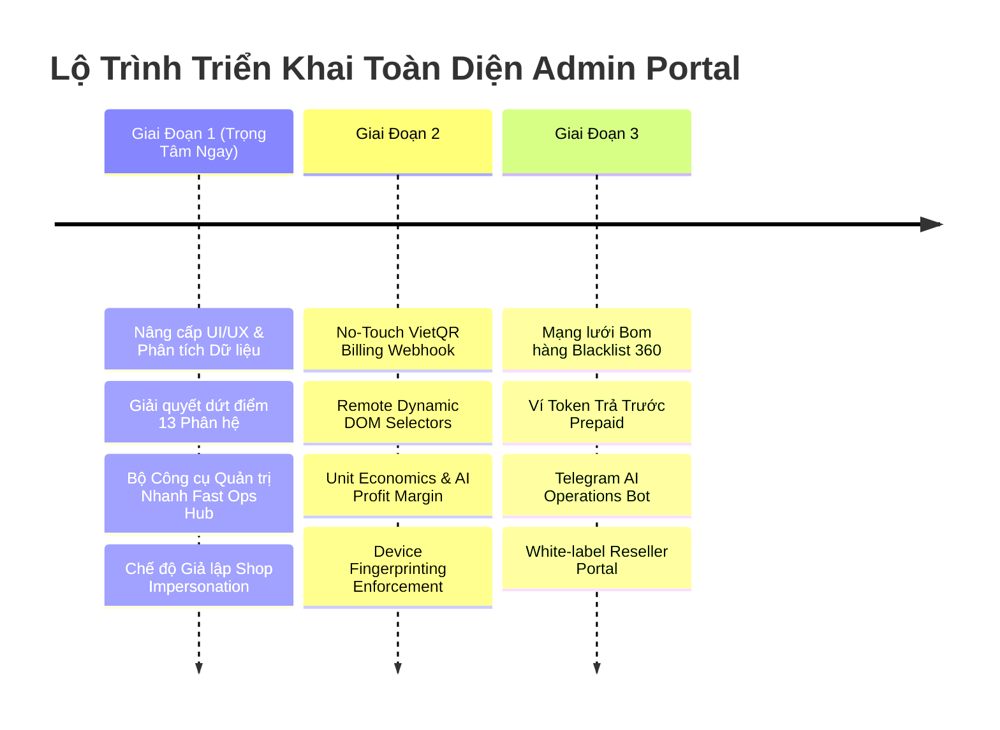

# Kế Hoạch Chi Tiết: Nâng Cấp Toàn Diện Hệ Thống Quản Trị Admin Portal (Commercial SaaS & 2026 Vision)

> **Implementation status — 28/08/2026:** Admin Phase 1 đã hoàn thành ở mã nguồn theo `implementation_plan.md`. Migration triển khai là `database/migrations/v66_admin_fast_operations.sql`; trạng thái nghiệm thu và bước vận hành còn lại được ghi trong `PROJECT_PROGRESS.md`.

> **Commercial Phase 2 status:** Đã hoàn thành nền tảng mã nguồn trong `database/migrations/v67_commercial_phase2_foundation.sql`; cần triển khai Supabase/Edge Function thực tế trước khi coi là production-ready.

> **Commercial Phase 3 status:** Đã hoàn thành nền tảng mã nguồn trong `database/migrations/v68_commercial_phase3_growth.sql`; các tích hợp Telegram và vận hành ví chỉ production-ready sau khi cấu hình secrets, scheduler và smoke-test giao dịch thật.

Tài liệu này là bản thiết kế kiến trúc và kế hoạch triển khai toàn diện cho hệ thống **Admin Control Plane** của Auto Fill Order, hướng tới chuẩn **Thương Mại Hóa B2B SaaS Chuyên Nghiệp** và đón đầu **Xu hướng Công nghệ 2026**.

---

## User Review Required

> [!IMPORTANT]
> **Các quyết định kiến trúc đã được chốt**:
> 1. **Phần 1 (5 Trụ cột Thương mại hóa)**: Tích hợp đầy đủ vào nền tảng cốt lõi (No-Touch VietQR Billing, Biên lợi nhuận AI từng shop, Giữ chân khách hàng Anti-Churn, Kiểm soát thiết bị phần cứng, Dynamic DOM Selectors không cần chờ duyệt Google).
> 2. **Phần 2 (5 Tính năng Đột phá 2026 được chọn)**: 
>    - `1. Fraud/Boom Shield 360°`: Mạng lưới cảnh báo bom hàng liên shop.
>    - `2. AI Self-Healing DOM`: Nhận diện giao diện tự động vá lỗi form nhà vận chuyển.
>    - `4. Prepaid Credit/Token Wallet`: Ví Token nạp trước trả theo đơn.
>    - `5. White-label Reseller Portal`: Cổng đại lý / bưu cục phân phối lại phần mềm.
>    - `6. Telegram AI Operations Agent`: Bot báo cáo doanh thu & sự cố 24/7.
> 3. **Phần 3 (Lộ trình Triển khai)**: Ưu tiên thực hiện ngay **Giai đoạn 1: Hoàn thiện Nền tảng Admin & Bộ Công cụ Quản trị Nhanh (Fast Operations Hub)**.

---

## PHẦN 1: 5 TRỤ CỘT THƯƠNG MẠI HÓA B2B SAAS CỐT LÕI

### 1.1. No-Touch Billing: Thanh Toán & Kích Hoạt Tự Động 100%
- **Cơ chế hoạt động**:
  - Sinh mã **VietQR Pro Động** với cú pháp nội dung duy nhất: `AFO <SHOP_ID_SHORT> <PLAN_CODE>`.
  - Kết nối Webhook Gateway (SePay / Casso / Open Banking) xử lý trong 1–3 giây.
  - Supabase Database Trigger tự động:
    - Cập nhật bảng `subscriptions` (trạng thái `active`, cộng thêm số ngày).
    - Cập nhật bảng `shop_quotas` (tăng hạn mức bóc tách đơn và số thiết bị).
    - Bắn tín hiệu Realtime qua Supabase Broadcast về Extension của Shop để mở khóa ngay lập tức.

### 1.2. Unit Economics & AI Profit Margin Control
- **Cơ chế hoạt động**:
  - Bảng thống kê chi tiết theo từng Shop:
    $$\text{Biên lợi nhuận (Margin)} = \text{Doanh thu gói thuê bao} - (\text{Số Tokens AI tiêu thụ} \times \text{Đơn giá API})$$
  - **Smart Model Router**:
    - Tin nhắn cơ bản (dưới 100 ký tự, có định dạng rõ) $\rightarrow$ Tuyến sang `Llama-3.1-8B-Instant` (Chi phí siêu rẻ, phản hồi ~300ms).
    - Tin nhắn phức tạp (dài, không dấu, viết tắt, địa chỉ khó) $\rightarrow$ Tuyến sang `Llama-3.3-70B` / `Gemini 1.5 Flash`.

### 1.3. Customer Retention & Anti-Churn Engine
- **Cơ chế hoạt động**:
  - Tự động phân loại Shop theo **Activity Index**:
    - 🟢 *Active / Power Seller*: Tạo đơn đều đặn hàng ngày.
    - 🟡 *At-Risk*: 3 ngày không phát sinh đơn bóc tách $\rightarrow$ Kích hoạt chuông thông báo chăm sóc.
    - 🔴 *Expiring Soon*: Còn 3 ngày hết hạn gói $\rightarrow$ Tự động gửi cảnh báo ưu đãi gia hạn.
  - Phân tích phễu chuyển đổi dùng thử (Trial Conversion Funnel): Đo lường tỷ lệ từ khi cài Extension đến khi nâng cấp gói trả phí.

### 1.4. Device Fingerprinting & Chống Chia Sẻ Tài Khoản Trái Phép
- **Cơ chế hoạt động**:
  - Thu thập mã nhận diện phần cứng trình duyệt (Hardware UUID + Canvas/WebGL Fingerprint + OS).
  - Cưỡng chế số thiết bị hoạt động đồng thời theo gói cước (Gói 1 máy, Gói 3 máy, Gói 10 máy).
  - Tự động khóa hoặc yêu cầu xác thực OTP khi phát hiện thiết bị thứ $N+1$ đăng nhập.

### 1.5. Remote Dynamic Selectors: Sửa Lỗi DOM Nhà Vận Chuyển Không Chờ Duyệt Store
- **Cơ chế hoạt động**:
  - Lưu trữ cấu hình bộ chọn HTML Selector của VNPost, J&T, ViettelPost trên bảng `system_configs` (`carrier_dom_selectors`).
  - Extension định kỳ đồng bộ cấu hình Selector này về cache cục bộ.
  - Khi nhà vận chuyển đổi giao diện, Admin cập nhật Selector mới trên Admin Portal $\rightarrow$ Toàn bộ mạng lưới Extension tự động nhận Selector mới trong **30 giây** mà không cần phát hành bản cập nhật Extension lên Chrome Web Store.

---

## PHẦN 2: 5 TÍNH NĂNG ĐỘT PHÁ NĂM 2026

### 2.1. Mạng Lưới Cảnh Báo Bom Hàng Liên Shop (Fraud / Boom Shield 360°)
* **Mô tả**: Xây dựng kho dữ liệu phân tích rủi ro khách hàng dựa trên lịch sử giao hàng trên toàn hệ thống (ẩn danh hóa thông tin theo Nghị định 13/2023/NĐ-CP).
* **Trải nghiệm**: Khi nhân viên bóc tách tin nhắn có số điện thoại khách hàng từng có 3 lần hoàn đơn / bom hàng tại các shop khác, màn hình hiện ngay cảnh báo đỏ:
  > ⚠️ **CẢNH BÁO RỦI RO (85% BOM HÀNG)**: Số điện thoại này đã có 3 đơn bị hoàn trong 30 ngày qua trên hệ thống. Khuyến nghị yêu cầu chuyển khoản cọc trước khi gửi hàng!
* **Giá trị kinh doanh**: Tính năng cao cấp (Upsell tính phí riêng hoặc chỉ mở cho gói PRO/ENTERPRISE).

### 2.2. AI Self-Healing DOM (Tự Vá Lỗi Giao Diện Điền Form Bằng Vision AI)
* **Mô tả**: Tích hợp mô hình thị giác AI gọn nhẹ (Client-side Vision Model). Khi các thẻ HTML bị mã hóa hoặc thay đổi selector class/ID, AI quét bố cục trang web dạng hình ảnh (Visual Layout Recognition), tự tìm ô "Họ tên", "Số điện thoại", "Địa chỉ", "Tiền COD" và điền chính xác.
* **Giá trị kỹ thuật**: Giảm 99% thời gian gián đoạn dịch vụ khi website hãng vận chuyển nâng cấp phiên bản.

### 2.4. Nền Kinh Tế Ví Token Trả Trước (Prepaid Credit & Pay-As-You-Go)
* **Mô tả**: Thay vì chỉ bán gói tháng cố định, hệ thống cung cấp **Ví Token**:
  - Nạp 50,000 VNĐ $\rightarrow$ Nhận 500 Token (100đ/lần bóc tách đơn AI).
  - Nạp 200,000 VNĐ $\rightarrow$ Nhận 2,500 Token (Tặng thêm 25%).
* **Giá trị kinh doanh**: Thu hút tệp khách hàng cá nhân bán hàng nhỏ lẻ, sinh viên, người mới kinh doanh chưa muốn cam kết thuê bao tháng.

### 2.5. Cổng Đại Lý / Đối Tác Phân Phối (White-Label Reseller Portal)
* **Mô tả**: Module dành riêng cho các Bưu cục VNPost, Đại lý nhượng quyền J&T, các kho hàng Fulfillment và phần mềm quản lý bán hàng (POS):
  - Đại lý được cấp link Affiliate hoặc Sub-Admin riêng.
  - Tự tạo mã giới thiệu, quản lý danh sách shop do mình giới thiệu và tự động nhận % hoa hồng định kỳ.
* **Giá trị kinh doanh**: Đòn bẩy mở rộng mạng lưới bán hàng với chi phí Marketing 0 đồng.

### 2.6. Trợ Lý Vận Hành Thông Minh Telegram Bot (AI Operations Agent)
* **Mô tả**: Bot Telegram kết nối trực tiếp với Supabase Database:
  - **Báo cáo tài chính định kỳ 20:00**: Báo cáo tổng doanh thu, số shop mới, số đơn hàng đã tạo trong ngày.
  - **Cảnh báo khẩn cấp (Realtime Alert)**: Tự động gửi tin nhắn kèm chuông báo khi phát hiện:
    - Tỷ lệ lỗi bóc tách AI > 5% trong 15 phút.
    - Cổng VNPost/J&T bị nghẽn mạng hoặc đổi giao diện.
    - Tài khoản Admin có đăng nhập từ IP lạ.

---

## PHẦN 3: KẾ HOẠCH TRIỂN KHAI CHI TIẾT TỪNG GIAI ĐOẠN

---

### CHI TIẾT GIAI ĐOẠN 1: HOÀN THIỆN NỀN TẢNG ADMIN & BỘ CÔNG CỤ QUẢN TRỊ NHANH (TRIỂN KHAI NGAY)

#### Bước 1: Xây dựng Nền tảng Thành phần Dùng chung (Core Shared Components)
1. **`src/ui/admin-dashboard/components/Pagination.jsx`**: Phân trang chuẩn hóa (10, 25, 50, 100 dòng, next/prev, jump page).
2. **`src/ui/admin-dashboard/components/FilterBar.jsx`**: Thanh tìm kiếm Debounce 300ms, bộ lọc đa tầng theo trạng thái, gói cước và khoảng thời gian.
3. **`src/ui/admin-dashboard/components/ExportButton.jsx`**: Xuất file CSV/Excel UTF-8 chuẩn tiếng Việt có dấu.
4. **`src/ui/admin-dashboard/components/FastOperationsHub.jsx`**: Thanh công cụ phản ứng nhanh đặt tại Header.
5. **`src/ui/admin-dashboard/components/Sidebar.jsx`**: Đồng bộ chính xác toàn bộ 13 menu items và icon chuyên nghiệp.

#### Bước 2: Nâng cấp Toàn diện Nhóm Quản trị (Management: Overview, Shops, Users, Subscriptions)
1. **Overview Dashboard (`Overview.jsx`)**:
   - Bộ chọn thời gian: 7 ngày, 30 ngày, tháng này, quý này.
   - Biểu đồ đa chỉ số: Tăng trưởng Shop, Doanh thu MRR, Tần suất AI Request & Tokens.
   - Quick Alert Center cảnh báo shop cạn Quota hoặc lỗi đồng bộ.
2. **Shops Management (`ShopList.jsx`)**:
   - Tích hợp **Modal Tạo Shop Nhanh** (gọi RPC `admin_create_shop_with_account`).
   - Nút **Cấp bù AI Quota 3 giây** (+500, +1000, +2000 đơn).
   - Modal **Chuyển nhượng quyền sở hữu Shop (Transfer Ownership)**.
   - **Chế độ Giả lập Shop (Impersonation Mode)** kèm Banner cảnh báo an toàn.
3. **Users Management (`Users.jsx`)**:
   - Modal **Mời & Tạo Admin Thật** (gán quyền vào `user_roles`).
   - Modal **Đổi Vai Trò Nhanh (RBAC Switcher)**.
   - Bảng xem danh sách các Shop mà User tham gia (`shop_members`).
4. **Subscriptions & Billing (`Subscriptions.jsx`)**:
   - Modal **Nâng/Hạ Gói Cước Thủ Công (Plan Override Wizard)**.
   - Nút thao tác nhanh: **Gia hạn +1 Tháng / +3 Tháng / +1 Năm**.
   - Badge cảnh báo màu sắc cho các gói sắp hết hạn.

#### Bước 3: Hoàn thiện Nhóm Hạ tầng & Vận hành (AI, Features, Address, Carriers, Devices, Security, Support, Releases)
1. **AI Platform (`Quotas.jsx`)**:
   - Biểu đồ **Top 10 Cửa Hàng Sử Dụng AI Nhiều Nhất**.
   - Thanh tiến độ Quota đổi màu trực quan: Xanh (<70%), Vàng (70-90%), Đỏ (>90%).
   - Cấp Quota AI hàng loạt cho nhóm shop.
2. **Carrier Health (`CarrierHealth.jsx`)**:
   - Nút kích hoạt kiểm tra trực tiếp DOM cổng VNPost/J&T (`Run Live Probe`).
   - Bảng lịch sử thay đổi Selector DOM.
3. **Device Management (`DeviceManagement.jsx`)**:
   - Lọc thiết bị theo Shop cụ thể.
   - Nút **Thu hồi toàn bộ thiết bị của Shop** vi phạm chia sẻ tài khoản.
4. **Security & RLS Center (`SecurityRLS.jsx`)**:
   - Tích hợp **Live Audit Trail Logs Viewer** (so sánh JSON Before/After, lọc theo Actor/Action).
5. **Support Tickets (`SupportTickets.jsx`)**:
   - Modal **Chi Tiết Yêu Cầu & Gửi Tin Nhắn Phản Hồi** cho Shop kèm ghi chú nội bộ.
6. **Release Center (`ReleaseCenter.jsx`)**:
   - Modal **Phát Hành Phiên Bản Mới** (Version, Min Version, Force Update, Rollout %, Release Notes).

---

## PROPOSED FILE MODIFICATIONS (GIAI ĐOẠN 1)

### [NEW] Components & Modals Mới
- [NEW] `src/ui/admin-dashboard/components/Pagination.jsx`
- [NEW] `src/ui/admin-dashboard/components/FilterBar.jsx`
- [NEW] `src/ui/admin-dashboard/components/ExportButton.jsx`
- [NEW] `src/ui/admin-dashboard/components/FastOperationsHub.jsx`
- [NEW] `src/ui/admin-dashboard/components/ImpersonationBanner.jsx`
- [NEW] `src/ui/admin-dashboard/modals/CreateShopModal.jsx`
- [NEW] `src/ui/admin-dashboard/modals/TopupQuotaModal.jsx`
- [NEW] `src/ui/admin-dashboard/modals/EditUserRoleModal.jsx`
- [NEW] `src/ui/admin-dashboard/modals/OverrideSubscriptionModal.jsx`
- [NEW] `src/ui/admin-dashboard/modals/PublishReleaseModal.jsx`
- [NEW] `src/ui/admin-dashboard/modals/TicketDetailModal.jsx`

### [MODIFY] Nâng cấp Các Phân Hệ Hiện Hữu
- [MODIFY] `src/ui/admin-dashboard/App.jsx`
- [MODIFY] `src/ui/admin-dashboard/components/Sidebar.jsx`
- [MODIFY] `src/ui/admin-dashboard/components/Header.jsx`
- [MODIFY] `src/ui/admin-dashboard/pages/Overview/Overview.jsx`
- [MODIFY] `src/ui/admin-dashboard/pages/Shops/ShopList.jsx`
- [MODIFY] `src/ui/admin-dashboard/pages/Users/Users.jsx`
- [MODIFY] `src/ui/admin-dashboard/pages/Subscriptions/Subscriptions.jsx`
- [MODIFY] `src/ui/admin-dashboard/pages/AIPlatform/Quotas.jsx`
- [MODIFY] `src/ui/admin-dashboard/pages/Carriers/CarrierHealth.jsx`
- [MODIFY] `src/ui/admin-dashboard/pages/Devices/DeviceManagement.jsx`
- [MODIFY] `src/ui/admin-dashboard/pages/Security/SecurityRLS.jsx`
- [MODIFY] `src/ui/admin-dashboard/pages/Support/SupportTickets.jsx`
- [MODIFY] `src/ui/admin-dashboard/pages/Releases/ReleaseCenter.jsx`
- [MODIFY] `src/domain/admin/admin.service.js`
- [MODIFY] `src/domain/admin/admin.repository.js`

---

## KẾ HOẠCH KIỂM THỬ & NGHIỆM THU (VERIFICATION PLAN)

1. **Kiểm thử Tạo Shop Nhanh**:
   - Mở Fast Operations Hub $\rightarrow$ Tạo shop mới $\rightarrow$ Kiểm tra Shop xuất hiện tức thì và đăng nhập thành công.
2. **Kiểm thử Cấp Bù AI Quota & Nâng Gói Cước**:
   - Cấp bù +500 đơn cho 1 shop $\rightarrow$ Kiểm tra số liệu tăng đúng và ghi log vào `audit_logs`.
3. **Kiểm thử Phân Trang, Tìm Kiếm & Export Excel**:
   - Kiểm tra lọc theo từ khóa, chuyển trang và tải file CSV không bị lỗi font tiếng Việt.
4. **Kiểm thử Giả Lập Shop (Impersonation Mode)**:
   - Kích hoạt giả lập $\rightarrow$ Kiểm tra banner cảnh báo màu cam $\rightarrow$ Dữ liệu đơn hàng khớp với Shop được chọn $\rightarrow$ Thoát giả lập an toàn.
5. **Kiểm thử Phân Quyền Bảo Mật RLS**:
   - Kiểm tra mọi thao tác đều được kiểm soát bởi quyền `SYSTEM_ADMIN` và ghi log kiểm toán đầy đủ.
