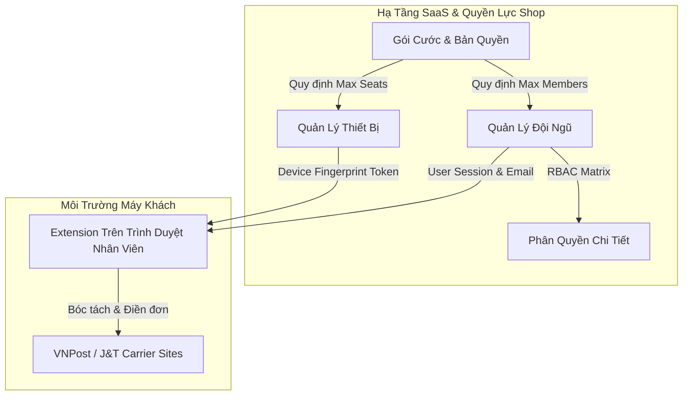

# 📦 ORDER AUTO FILL - BẢN THIẾT KẾ THƯƠNG MẠI HÓA (SAAS COMMERCIALIZATION SPEC)
> **Dành cho Codex / Vibe Coding / AI Agent**: Bản đặc tả kỹ thuật chi tiết để triển khai trọn gói hệ thống B2B SaaS cho Extension Auto Fill: Quản lý Đội ngũ (Team 360), Quản lý Thiết bị & Hạn ngạch (Device Seat Quota), Bảo mật Phiên đăng nhập (Session Security), và Tự động hóa Gói cước (Monetization Engine).

---

## 🎯 1. TỔNG QUAN HỆ THỐNG & TRIẾT LÝ VIBE CODING

* **Kiến trúc:** React 18 + Supabase Cloud (PostgreSQL, RLS, Edge Functions/RPC, Auth).
* **Mô hình Doanh thu (Monetization Core):** Tính phí định kỳ (MRR) theo **Số lượng Thiết bị (Device Seats)** + **Hạn mức Đội ngũ (Staff Seats)** + **Tính năng Nâng cao (CRM 360, Chống bom hàng, Webhook)**.
* **Mục tiêu UX/UI:** Đạt chuẩn SaaS B2B hiện đại, trực quan, 1-Click action, không hiển thị UUID thô, có trạng thái trực tiếp (Real-time indicators) và nút nâng cấp gói tự nhiên (Contextual Upsell).



---

## 🗄️ 2. CƠ SỞ DỮ LIỆU & SUPABASE SQL MIGRATION (DB SCHEMA)

### 2.1. Cập nhật Bảng Thành viên & Profiles
```sql
-- Migration: v7_commercial_team_devices.sql

-- 1. Bảng Profiles người dùng (Đồng bộ với auth.users)
CREATE TABLE IF NOT EXISTS public.profiles (
    id UUID PRIMARY KEY REFERENCES auth.users(id) ON DELETE CASCADE,
    email TEXT NOT NULL,
    full_name TEXT,
    phone TEXT,
    avatar_url TEXT,
    created_at TIMESTAMPTZ DEFAULT NOW(),
    updated_at TIMESTAMPTZ DEFAULT NOW()
);

-- Trigger tự động tạo profile khi user đăng ký
CREATE OR REPLACE FUNCTION public.handle_new_user()
RETURNS TRIGGER AS $$
BEGIN
    INSERT INTO public.profiles (id, email, full_name, avatar_url)
    VALUES (
        NEW.id,
        NEW.email,
        COALESCE(NEW.raw_user_meta_data->>'full_name', split_part(NEW.email, '@', 1)),
        NEW.raw_user_meta_data->>'avatar_url'
    )
    ON CONFLICT (id) DO UPDATE
    SET email = EXCLUDED.email,
        updated_at = NOW();
    RETURN NEW;
END;
$$ LANGUAGE plpgsql SECURITY DEFINER;

DROP TRIGGER IF EXISTS on_auth_user_created ON auth.users;
CREATE TRIGGER on_auth_user_created
    AFTER INSERT ON auth.users
    FOR EACH ROW EXECUTE FUNCTION public.handle_new_user();

-- 2. Bổ sung liên kết và metadata cho shop_members
ALTER TABLE public.shop_members 
ADD COLUMN IF NOT EXISTS invited_by UUID REFERENCES auth.users(id),
ADD COLUMN IF NOT EXISTS invite_token TEXT,
ADD COLUMN IF NOT EXISTS invite_expires_at TIMESTAMPTZ,
ADD COLUMN IF NOT EXISTS notes TEXT;

-- 3. Bổ sung thông tin cho devices (Quản lý thiết bị & Remote Kill)
ALTER TABLE public.devices
ADD COLUMN IF NOT EXISTS device_name TEXT,
ADD COLUMN IF NOT EXISTS os_info TEXT,
ADD COLUMN IF NOT EXISTS client_version TEXT,
ADD COLUMN IF NOT EXISTS is_active BOOLEAN DEFAULT TRUE,
ADD COLUMN IF NOT EXISTS last_ip TEXT,
ADD COLUMN IF NOT EXISTS last_location TEXT;

-- 4. Bảng Lời mời tham gia Shop (Shop Invites)
CREATE TABLE IF NOT EXISTS public.shop_invites (
    id UUID PRIMARY KEY DEFAULT gen_random_uuid(),
    shop_id UUID NOT NULL REFERENCES public.shops(id) ON DELETE CASCADE,
    email TEXT NOT NULL,
    role TEXT NOT NULL DEFAULT 'STAFF',
    token TEXT NOT NULL UNIQUE,
    invited_by UUID NOT NULL REFERENCES auth.users(id),
    status TEXT NOT NULL DEFAULT 'PENDING', -- 'PENDING', 'ACCEPTED', 'EXPIRED', 'REVOKED'
    expires_at TIMESTAMPTZ NOT NULL DEFAULT (NOW() + INTERVAL '7 days'),
    created_at TIMESTAMPTZ DEFAULT NOW()
);
```

### 2.2. RPC Functions Tối ưu cho Frontend (Bảo Mật & Hiệu Năng)

```sql
-- 1. Lấy danh sách thành viên đầy đủ thông tin (Thay thế UUID bằng Name/Email/Stats)
CREATE OR REPLACE FUNCTION public.owner_get_members_v3(p_shop_id UUID)
RETURNS TABLE (
    member_id UUID,
    user_id UUID,
    email TEXT,
    full_name TEXT,
    avatar_url TEXT,
    role_code TEXT,
    status TEXT,
    created_at TIMESTAMPTZ,
    orders_count BIGINT
) AS $$
BEGIN
    -- Kiểm tra người gọi có quyền xem shop
    IF NOT EXISTS (
        SELECT 1 FROM public.shop_members 
        WHERE shop_id = p_shop_id AND user_id = auth.uid() AND status = 'ACTIVE'
    ) THEN
        RAISE EXCEPTION 'Không có quyền truy cập cửa hàng này.';
    END IF;

    RETURN QUERY
    SELECT 
        sm.id AS member_id,
        sm.user_id,
        COALESCE(p.email, 'Chưa kích hoạt') AS email,
        COALESCE(p.full_name, split_part(p.email, '@', 1), 'Thành viên') AS full_name,
        p.avatar_url,
        sm.role::TEXT AS role_code,
        sm.status::TEXT AS status,
        sm.created_at,
        (SELECT COUNT(*) FROM public.submitted_orders o WHERE o.shop_id = p_shop_id AND o.created_by = sm.user_id) AS orders_count
    FROM public.shop_members sm
    LEFT JOIN public.profiles p ON p.id = sm.user_id
    WHERE sm.shop_id = p_shop_id AND sm.removed_at IS NULL
    ORDER BY 
        CASE sm.role 
            WHEN 'OWNER' THEN 1 
            WHEN 'MANAGER' THEN 2 
            WHEN 'STAFF' THEN 3 
            ELSE 4 
        END,
        sm.created_at ASC;
END;
$$ LANGUAGE plpgsql SECURITY DEFINER;

-- 2. Đổi tên thiết bị (Gán nhãn thân thiện: VD: "Máy Đóng Hàng 1")
CREATE OR REPLACE FUNCTION public.owner_update_device_name(p_device_id TEXT, p_device_name TEXT)
RETURNS JSONB AS $$
DECLARE
    v_shop_id UUID;
BEGIN
    SELECT shop_id INTO v_shop_id FROM public.devices WHERE id = p_device_id;
    IF v_shop_id IS NULL THEN
        RETURN jsonb_build_object('success', false, 'message', 'Không tìm thấy thiết bị');
    END IF;

    -- Chỉ OWNER hoặc MANAGER mới được đổi tên thiết bị
    IF NOT EXISTS (
        SELECT 1 FROM public.shop_members 
        WHERE shop_id = v_shop_id AND user_id = auth.uid() AND role IN ('OWNER', 'MANAGER')
    ) THEN
        RETURN jsonb_build_object('success', false, 'message', 'Không đủ quyền hạn');
    END IF;

    UPDATE public.devices 
    SET device_name = p_device_name, updated_at = NOW() 
    WHERE id = p_device_id;

    RETURN jsonb_build_object('success', true, 'message', 'Đã cập nhật tên thiết bị');
END;
$$ LANGUAGE plpgsql SECURITY DEFINER;

-- 3. Tạo lời mời kèm Invite Token
CREATE OR REPLACE FUNCTION public.owner_create_invite_link(p_shop_id UUID, p_role TEXT DEFAULT 'STAFF')
RETURNS JSONB AS $$
DECLARE
    v_token TEXT;
BEGIN
    IF NOT EXISTS (
        SELECT 1 FROM public.shop_members 
        WHERE shop_id = p_shop_id AND user_id = auth.uid() AND role IN ('OWNER', 'MANAGER')
    ) THEN
        RETURN jsonb_build_object('success', false, 'message', 'Chỉ Chủ shop hoặc Quản lý mới được tạo link mời.');
    END IF;

    v_token := encode(gen_random_bytes(16), 'hex');

    INSERT INTO public.shop_invites (shop_id, email, role, token, invited_by)
    VALUES (p_shop_id, 'LINK_INVITE', p_role, v_token, auth.uid());

    RETURN jsonb_build_object(
        'success', true, 
        'token', v_token, 
        'invite_url', 'https://options.orderautofill.com/#/join?token=' || v_token
    );
END;
$$ LANGUAGE plpgsql SECURITY DEFINER;
```

---

## 🎨 3. THIẾT KẾ FRONTEND REACT COMPONENT SPECS

### 3.1. Trang 1: `Team.jsx` (Nhân Viên & Đội Ngũ 360°)
* **Đường dẫn file:** `src/ui/options/pages/Team/Team.jsx`
* **Tính năng bắt buộc:**
  1. **Thẻ Tóm Tắt (KPI Cards):** Tổng nhân viên, Đang hoạt động, Lời mời chờ, Tổng đơn hàng đội ngũ đã tạo.
  2. **Thanh Thao Tác Mời:**
     * Nút `Mời qua Email`: Modal nhập email + Chọn Role (`Nhân viên`, `Quản lý`).
     * Nút `Tạo Link Mời Nhanh`: Sinh link mời 1-click kèm nút `Copy Link` tiện lợi.
  3. **Bảng Thành Viên:**
     * Cột 1: Avatar tròn chữ cái hoặc ảnh + Họ tên + Email.
     * Cột 2: Badge Vai trò (`Chủ shop (Owner)` - Tím, `Quản lý` - Xanh dương, `Nhân viên` - Xanh lá).
     * Cột 3: Hiệu suất (`Đã tạo 128 đơn`).
     * Cột 4: Trạng thái (`Hoạt động` - Xanh lá, `Tạm khóa` - Vàng cam).
     * Cột 5: Menu Thao tác (`Đổi vai trò`, `Tạm dừng`, `Xóa khỏi Shop`).

### 3.2. Trang 2: `DeviceManagement.jsx` (Quản Lý Thiết Bị & Hạn Ngạch)
* **Đường dẫn file:** `src/ui/options/pages/Security/DeviceManagement.jsx`
* **Tính năng bắt buộc:**
  1. **Thanh Tiến Trình Hạn Ngạch (Quota Progress Bar):**
     * Hiển thị: `Đang kết nối: 3 / 5 thiết bị (60%)`.
     * Thanh progress bar trực quan (Chuyển vàng khi $>80\%$, đỏ khi đầy $100\%$).
     * Nút Kêu gọi Mua thêm (CTA): `⚡ + Mua Thêm Thiết Bị (+50k/tháng)` mở modal hoặc chuyển sang tab Gói cước.
  2. **Bảng Thiết Bị Đang Hoạt Động:**
     * Tên thiết bị kèm biểu tượng: `💻 [Kho Tân Bình] Máy In Bill 01 (Chrome 128 - Windows 11)`.
     * Cho phép bấm vào icon ✏️ để **Đổi tên thiết bị** ngay tại chỗ.
     * Người dùng & Vị trí: `admin@luathuysinh.vn • TP. Hồ Chí Minh (113.161.x.x)`.
     * Thời gian hoạt động cuối: `2 phút trước` (Tính động theo `lastActive()`).
     * Nút Thao tác: Nút đỏ `🔴 Thu Hồi Quyền (Revoke)` có hộp thoại xác nhận an toàn.

### 3.3. Trang 3: `Security.jsx` (Bảo Mật & Phiên Đăng Nhập)
* **Đường dẫn file:** `src/ui/options/pages/Security/Security.jsx`
* **Tính năng bắt buộc:**
  1. **Danh sách Phiên Đăng Nhập Động:**
     * Phân biệt rõ ràng: `Thiết bị này (Phiên hiện tại) - Badge Xanh` vs các thiết bị khác.
     * Nút lớn: `🚪 Đăng xuất khỏi tất cả thiết bị khác` (Tự động xóa token các phiên cũ).
  2. **Form Đổi Mật Khẩu:**
     * Mật khẩu hiện tại, Mật khẩu mới, Xác nhận mật khẩu mới.
     * Kiểm tra độ an toàn (Tối thiểu 8 ký tự, có số và chữ cái).
  3. **Lịch Sử Hoạt Động Bảo Mật:**
     * Bảng nhật ký: Lần đổi mật khẩu gần nhất, Lần đăng nhập từ IP lạ.

---

## ⚡ 4. PROMPT VIBE CODING MẪU (SẴN SÀNG COPY & PASTE CHO CODEX/AI)

### 📌 Prompt 1: Nâng cấp `Team.jsx` với Dữ Liệu Thật, Avatar, Thống Kê & Link Mời
```text
Hãy cập nhật component `src/ui/options/pages/Team/Team.jsx` để đạt chuẩn SaaS B2B thương mại:
1. Thay thế hiển thị UUID thô bằng thông tin đầy đủ: Avatar viết tắt chữ cái, Tên đầy đủ, Email, Số đơn hàng đã tạo.
2. Thêm thanh công cụ mời nhân viên: Cho phép mời qua Email hoặc tạo 'Link mời nhanh' kèm nút Copy to clipboard.
3. Hỗ trợ thay đổi vai trò (Owner, Manager, Staff) trực tiếp từ bảng qua dropdown hoặc modal.
4. Thêm xác nhận an toàn trước khi xóa hoặc tạm khóa nhân viên khỏi Shop.
5. Đảm bảo giao diện hiện đại (shadcn/tailwind style), hỗ trợ cả Light Mode và Dark Mode mượt mà.
```

### 📌 Prompt 2: Nâng cấp `DeviceManagement.jsx` Quản Lý Hạn Ngạch & Đổi Tên Thiết Bị
```text
Hãy nâng cấp component `src/ui/options/pages/Security/DeviceManagement.jsx`:
1. Thêm Quota Progress Bar trực quan hiển thị số thiết bị đã dùng / tổng hạn ngạch (VD: 3/5 thiết bị) kèm nút CTA '+ Mua Thêm Thiết Bị' chuyển đến tab Gói cước.
2. Cho phép chủ shop bấm nút Edit để đổi tên thân thiện cho thiết bị (VD: '[Kho 1] Máy Bưu Điện 01') và lưu qua RPC hoặc REST API.
3. Hiển thị thông tin trình duyệt, hệ điều hành, địa chỉ IP và lần online cuối (relative time: '2 phút trước').
4. Thao tác 'Thu hồi thiết bị' phải có confirm modal và gửi audit log, đồng thời cập nhật tức thì UI.
```

### 📌 Prompt 3: Hoàn Thiện `Security.jsx` Động & Đổi Mật Khẩu
```text
Hãy viết lại `src/ui/options/pages/Security/Security.jsx` từ component tĩnh thành component động đầy đủ chức năng:
1. Kết nối dữ liệu phiên đăng nhập thực tế của Supabase Auth (hiển thị phiên hiện tại và các phiên khác).
2. Thêm chức năng 'Đăng xuất tất cả thiết bị khác' (Revoke other sessions).
3. Thêm form 'Đổi mật khẩu tài khoản' có validate độ mạnh mật khẩu và thông báo toast thành công/thất bại.
4. Giữ phong cách UI sạch đẹp, chuyên nghiệp, đồng bộ với toàn bộ Options Dashboard.
```

---

## 💡 5. CHECKLIST ĐÁNH GIÁ CHẤT LƯỢNG (COMMERCIAL READINESS)

- [ ] **Không còn UUID thô:** Toàn bộ bảng dữ liệu hiển thị Tên/Email/Avatar người thật.
- [ ] **Khóa bản quyền chặt chẽ:** Nếu thiết bị vượt quá `max_devices` của Shop, Extension tự động hiển thị panel `Vượt giới hạn thiết bị`.
- [ ] **Thu hồi quyền tức thì (Kill-switch):** Bấm Thu hồi trên Webapp $\rightarrow$ Extension trên máy đó bị chặn ngay lập tức.
- [ ] **Luồng mời nhân sự mượt mà:** Nhân viên vào qua Invite Link được tự động gắn vào Shop mà không cần admin cấu hình tay.
- [ ] **Kiểm thử tự động:** Chạy `npm test` và `npm run sync:ext` để đảm bảo 100% test suites passed!
