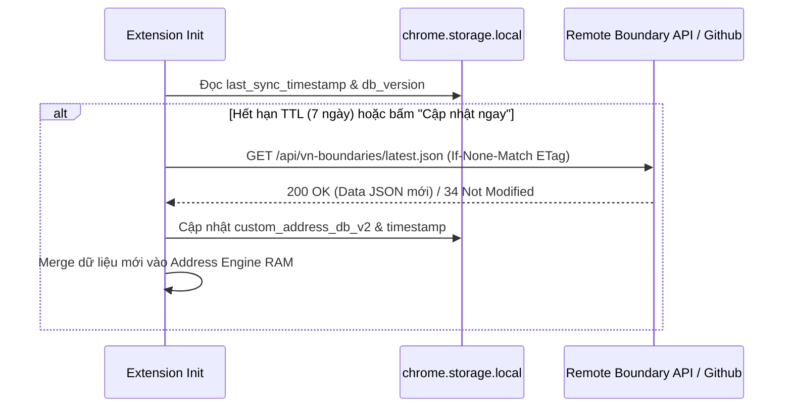
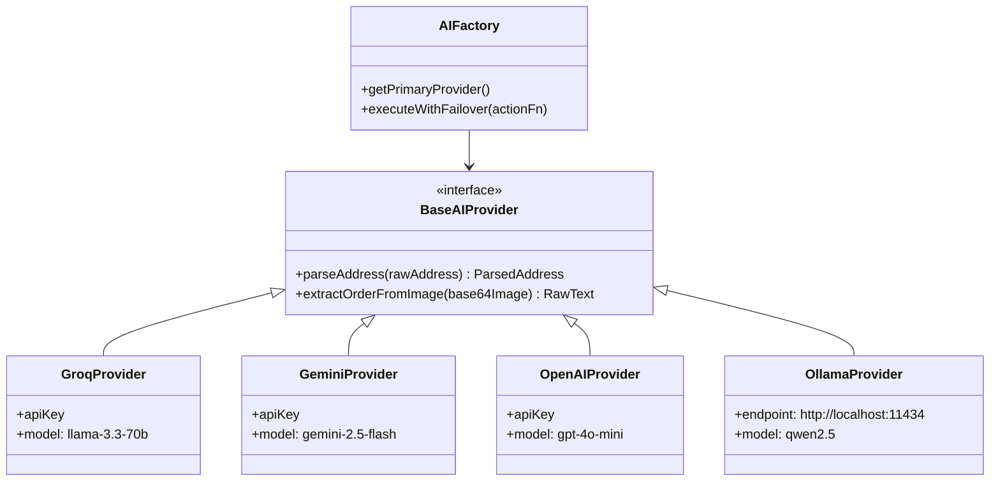
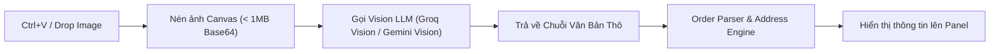

# 🚀 Vibe Coding Specification: Auto Fill Order Extension (v2.0 Upgrade)

Tài liệu đặc tả chi tiết kiến trúc, dữ liệu và từng bước triển khai 4 tính năng mở rộng cho dự án **Auto Fill Order Extension**. Tài liệu được tối ưu hóa cho lập trình AI (Vibe Coding) để thực thi trực tiếp không gây xung đột codebase.

---

## 📋 Mục lục các Tính năng
1. [Feature 1: Cập nhật Dữ liệu Địa giới Hành chính Tự động (Auto Administrative Boundary Sync)](#feature-1-c%E1%BA%ADp-nh%E1%BA%ADt-d%E1%BB%B1-li%E1%BB%87u-%C4%91%E1%BB%8Ba-gi%E1%BB%9Bi-h%C3%A0nh-ch%C3%ADnh-t%E1%BB%B1-%C4%91%E1%BB%99ng)
2. [Feature 2: Cảnh báo Đơn hàng Rủi ro (Delivery Risk & Fraud Alert)](#feature-2-c%E1%BA%A3nh-b%C3%A1o-%C4%91%C6%A1n-h%C3%A0nh-r%E1%BB%A7i-ro)
3. [Feature 3: Multi-LLM Provider Selection & Auto-Failover](#feature-3-multi-llm-provider-selection--auto-failover)
4. [Feature 4: OCR Bóc tách Đơn hàng từ Ảnh (Vision AI Image-to-Order)](#feature-4-ocr-b%C3%B3c-t%C3%A1ch-%C4%91%C6%A1n-h%C3%A0nh-t%E1%BB%AB-%E1%BA%A3nh-vision-ai)

---

## Feature 1: Cập nhật Dữ liệu Địa giới Hành chính Tự động

### 🎯 Mục tiêu
Tự động kiểm tra, tải và cập nhật danh mục Tỉnh/Thành - Huyện/Quận - Xã/Phường mới nhất từ CDN/API công khai (tránh lỗi sáp nhập/thay đổi tên địa giới hành chính).

### 📐 Kiến trúc & Tệp tin
- `backend/features/address/database/sync.js`: Module kiểm tra version & tải delta update.
- Cache lưu trong `chrome.storage.local` key `custom_address_db_v2`.

### 🔄 Luồng dữ liệu (Data Flow)


### 💻 Code Structure & Interface

#### `backend/features/address/database/sync.js`
```javascript
const ADDRESS_SYNC_CONFIG = {
  ENDPOINT: 'https://cdn.jsdelivr.net/gh/madnh/vietnam-administrative-division-json@master/dist/tree.json',
  CACHE_KEY: 'vn_address_db_cache',
  TTL_MS: 7 * 24 * 60 * 60 * 1000 // 7 ngày
};

class AddressDBSync {
  static async checkAndSync(force = false) {
    const { vn_address_db_cache, last_sync_time } = await chrome.storage.local.get([
      ADDRESS_SYNC_CONFIG.CACHE_KEY,
      'last_sync_time'
    ]);

    const isExpired = !last_sync_time || (Date.now() - last_sync_time > ADDRESS_SYNC_CONFIG.TTL_MS);
    if (!force && !isExpired && vn_address_db_cache) {
      return { updated: false, data: vn_address_db_cache };
    }

    try {
      const res = await fetch(ADDRESS_SYNC_CONFIG.ENDPOINT);
      if (!res.ok) throw new Error(`HTTP error ${res.status}`);
      const freshData = await res.json();
      
      // Chuẩn hóa định dạng về chuẩn Address Engine
      const normalizedData = this.transformData(freshData);
      
      await chrome.storage.local.set({
        [ADDRESS_SYNC_CONFIG.CACHE_KEY]: normalizedData,
        last_sync_time: Date.now()
      });

      return { updated: true, data: normalizedData };
    } catch (err) {
      console.warn('[AddressSync] Sync failed, fallback to built-in data:', err);
      return { updated: false, data: null, error: err.message };
    }
  }

  static transformData(rawData) {
    // Transformer map từ API chuẩn về DB format của Extension
    return rawData;
  }
}
```

---

## Feature 2: Cảnh báo Đơn hàng Rủi ro

### 🎯 Mục tiêu
Phát hiện các đơn hàng có độ rủi ro cao (SĐT từng có lịch sử bom hàng/hoàn đơn, Địa chỉ vùng đảo/cước xa vượt ngưỡng, Địa chỉ thiếu thông tin nghiêm trọng) và hiển thị Badge cảnh báo màu sắc trên Floating Panel.

### 📐 Kiến trúc & Tệp tin
- `backend/features/risk/risk-detector.js`: Động cơ đánh giá rủi ro dựa trên bộ luật & lịch sử Firestore.
- `frontend/panel/panel.js`: Hiển thị Badge rủi ro (LOW - Xanh, MEDIUM - Vàng, HIGH - Đỏ).

### 📊 Thang điểm Rủi ro (Risk Scoring System)
| Tiêu chí | Trọng số score | Mức độ cảnh báo | Hành động đề xuất |
| :--- | :--- | :--- | :--- |
| SĐT nằm trong Blacklist Firestore | +100 pt | 🔴 **HIGH (Nghiêm trọng)** | Yêu cầu chuyển khoản cọc trước |
| SĐT từng hoàn > 2 đơn trong history | +50 pt | 🟡 **MEDIUM (Trung bình)** | Gọi điện xác nhận lại |
| Địa chỉ thuộc Xã Huyện Đảo / Vùng bão lũ | +30 pt | 🟡 **MEDIUM (Trung bình)** | Kiểm tra phụ phí cước xa |
| Thiếu Số nhà / Đường cụ thể | +20 pt | 🟢 **LOW (Nhẹ)** | Nhắc nhở xin thêm số nhà |

### 💻 Code Structure & Interface

#### `backend/features/risk/risk-detector.js`
```javascript
class RiskDetector {
  static async evaluateOrder(parsedOrder) {
    let score = 0;
    const reasons = [];

    const { phone, address, codAmount } = parsedOrder;

    // 1. Kiểm tra SĐT trong Blacklist local / Firestore
    if (phone) {
      const isBlacklisted = await this.checkPhoneBlacklist(phone);
      if (isBlacklisted) {
        score += 100;
        reasons.push('SĐT có trong danh sách Cảnh báo bom hàng!');
      }

      // Kiểm tra lịch sử hoàn đơn
      const returnCount = await this.getPhoneReturnHistoryCount(phone);
      if (returnCount >= 2) {
        score += 50;
        reasons.push(`SĐT từng có ${returnCount} đơn bị hoàn/hủy!`);
      }
    }

    // 2. Kiểm tra vùng địa lý cước cao / Huyện đảo
    if (address) {
      const isSpecialZone = /huyện đảo|xã đảo|có con/i.test(address);
      if (isSpecialZone) {
        score += 30;
        reasons.push('Địa chỉ thuộc khu vực hải đảo/vùng xa (phụ phí cao).');
      }
    }

    // Phân cấp Rủi ro
    let level = 'LOW';
    let color = '#10B981'; // Green
    if (score >= 80) {
      level = 'HIGH';
      color = '#EF4444'; // Red
    } else if (score >= 30) {
      level = 'MEDIUM';
      color = '#F59E0B'; // Amber
    }

    return { score, level, color, reasons };
  }

  static async checkPhoneBlacklist(phone) {
    const { blacklist = [] } = await chrome.storage.local.get('blacklist');
    return blacklist.includes(phone.trim());
  }

  static async getPhoneReturnHistoryCount(phone) {
    const history = globalThis.SplitHistory?.getHistory() || [];
    return history.filter(h => h.phone === phone && h.status === 'returned').length;
  }
}
```

---

## Feature 3: Multi-LLM Provider Selection & Auto-Failover

### 🎯 Mục tiêu
Cho phép người dùng chọn nhà cung cấp AI ưa thích (Groq, Gemini, OpenAI, Ollama Local) và tự động chuyển đổi sang Provider dự phòng (Failover) nếu Provider chính gặp lỗi 429 Rate Limit hoặc Quota Exceeded.

### 📐 Kiến trúc Unified Adapter


### 💻 Code Structure

#### `backend/features/ai/provider-factory.js`
```javascript
class AIFactory {
  static getProvider(name, config) {
    switch (name) {
      case 'gemini':
        return new GeminiProvider(config.geminiApiKey);
      case 'openai':
        return new OpenAIProvider(config.openaiApiKey);
      case 'ollama':
        return new OllamaProvider(config.ollamaEndpoint || 'http://localhost:11434');
      case 'groq':
      default:
        return new GroqProvider(config.groqApiKey);
    }
  }

  static async executeWithFailover(taskName, payload) {
    const settings = await chrome.storage.local.get([
      'aiProviderPrimary', 
      'aiProviderSecondary',
      'groqApiKey',
      'geminiApiKey',
      'openaiApiKey',
      'ollamaEndpoint'
    ]);

    const primaryName = settings.aiProviderPrimary || 'groq';
    const secondaryName = settings.aiProviderSecondary || 'gemini';

    try {
      const primary = this.getProvider(primaryName, settings);
      return await primary[taskName](payload);
    } catch (err) {
      console.warn(`[AIFactory] Primary provider (${primaryName}) failed: ${err.message}. Failover to ${secondaryName}...`);
      if (secondaryName && secondaryName !== primaryName) {
        const secondary = this.getProvider(secondaryName, settings);
        return await secondary[taskName](payload);
      }
      throw err;
    }
  }
}
```

#### Ví dụ Adapter Gemini: `backend/features/ai/providers/gemini.js`
```javascript
class GeminiProvider {
  constructor(apiKey) {
    this.apiKey = apiKey;
    this.baseUrl = 'https://generativelanguage.googleapis.com/v1beta/models/gemini-2.5-flash:generateContent';
  }

  async parseAddress(rawAddress) {
    if (!this.apiKey) throw new Error('Chưa cấu hình Gemini API Key!');

    const prompt = `Phân tích địa chỉ Việt Nam sau thành JSON: "${rawAddress}".
Trả về JSON đúng format: {"province": "...", "district": "...", "ward": "...", "street": "..."}`;

    const res = await fetch(`${this.baseUrl}?key=${this.apiKey}`, {
      method: 'POST',
      headers: { 'Content-Type': 'application/json' },
      body: JSON.stringify({
        contents: [{ parts: [{ text: prompt }] }],
        generationConfig: { responseMimeType: "application/json" }
      })
    });

    if (!res.ok) throw new Error(`Gemini API Error: ${res.status}`);
    const data = await res.json();
    const text = data.candidates[0].content.parts[0].text;
    return JSON.parse(text);
  }
}
```

---

## Feature 4: OCR Bóc tách Đơn hàng từ Ảnh (Vision AI)

### 🎯 Mục tiêu
Cho phép người dùng dán ảnh chụp màn hình (`Ctrl+V`), kéo thả (Drag & Drop) hoặc tải file ảnh vào Floating Panel. AI Vision sẽ quét ảnh tin nhắn chốt đơn và trích xuất chữ thô để đưa vào bộ máy bóc tách.

### 📐 Kiến trúc & Tệp tin
- `backend/features/ocr/ocr-engine.js`: Xử lý nén ảnh, chuyển đổi Base64 và gửi tới Vision LLM API.
- `frontend/panel/panel.js`: Thêm ô Dropzone dán ảnh & Xem trước Thumbnail ảnh.

### 🔄 Luồng xử lý OCR


### 💻 Code Structure & Interface

#### `backend/features/ocr/ocr-engine.js`
```javascript
class OCREngine {
  // Nén ảnh canvas để tối ưu dung lượng truyền qua API
  static async compressImageToBase64(fileOrBlob, maxWidth = 1024) {
    return new Promise((resolve, reject) => {
      const img = new Image();
      img.onload = () => {
        const scale = Math.min(1, maxWidth / img.width);
        const canvas = document.createElement('canvas');
        canvas.width = img.width * scale;
        canvas.height = img.height * scale;
        const ctx = canvas.getContext('2d');
        ctx.drawImage(img, 0, 0, canvas.width, canvas.height);
        resolve(canvas.toDataURL('image/jpeg', 0.85));
      };
      img.onerror = reject;
      img.src = URL.createObjectURL(fileOrBlob);
    });
  }

  static async processImage(fileOrBlob) {
    const base64Image = await this.compressImageToBase64(fileOrBlob);
    
    // Gọi Vision AI thông qua AIFactory
    const extractedText = await AIFactory.executeWithFailover('extractOrderFromImage', base64Image);
    return extractedText;
  }
}
```

#### Lắng nghe sự kiện Paste Ảnh trong `frontend/panel/panel.js`:
```javascript
// Thêm event listener cho ô nhập liệu hoặc toàn bộ Shadow Panel
panelEl.addEventListener('paste', async (e) => {
  const items = (e.clipboardData || e.originalEvent.clipboardData).items;
  for (const item of items) {
    if (item.type.indexOf('image') === 0) {
      e.preventDefault();
      const blob = item.getAsFile();
      
      Toast.info('Đang đọc hình ảnh bằng Vision AI...');
      try {
        const rawText = await OCREngine.processImage(blob);
        getVnpostEl('rawTextInput').value = rawText;
        // Tự động kích hoạt bóc tách sau khi đọc ảnh xong
        getVnpostEl('btnParse').click();
        Toast.success('Đã trích xuất thông tin từ ảnh!');
      } catch (err) {
        Toast.error('Không thể đọc ảnh: ' + err.message);
      }
      break;
    }
  }
});
```

---

## 📌 Hướng dẫn Vibe Coding (Implementation Checklist for AI)

Khi đưa file đặc tả này cho AI Coding Agent thực thi, hãy chạy theo từng gói công việc (Work Package):

- [ ] **Task 1**: Tạo `backend/features/address/database/sync.js` và tích hợp vào `content/index.js`.
- [ ] **Task 2**: Tạo `backend/features/risk/risk-detector.js` và hiển thị Risk Badge màu sắc lên `frontend/panel/panel.js`.
- [ ] **Task 3**: Refactor bộ máy AI thành `AIFactory` & các Provider Adapter (`gemini.js`, `groq.js`, `openai.js`, `ollama.js`) và thêm phần chọn Provider trong `options.html`.
- [ ] **Task 4**: Triển khai `backend/features/ocr/ocr-engine.js` và lắng nghe sự kiện `paste` ảnh trong Shadow DOM Panel.
